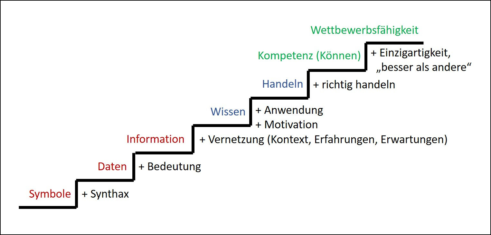

# Wissensmanagement:

## Wissen als Ressource im betrieblichen Kontext

„Ich weiß, dass ich nichts weiß“ sagte schon Sokrates. Mit der Schnelllebigkeit und Fülle der heutigen Informationen und Veränderungen, ist diese Aussage vielleicht noch deutlicher nachvollziehbar, wenn auch in einem leicht gewandelten Kontext. Als Mensch muss man einsehen, dass die eigene Kapazität, Wissen aufzunehmen begrenzt ist. Doch sowohl für ein Individuum, als auch für einen wirtschaftlich agierenden Betrieb gilt, dass „Eine Investition in Wissen […] noch immer die besten Zinsen [bringt].“ (Benjamin Franklin)
Wissen muss hier als Ressource gesehen werden, die genau wie jede andere Ressource zur richtigen Zeit, in der richtigen Menge oder Ausprägung am richtigen Ort oder eben im richtigen Kopf vorhanden sein muss. Die Vielfalt und Menge an Know-How bedeutet im Endeffekt, wie effektiv ein Betrieb sein kann.^1 Um das Wissen effizient zu nutzen, gilt es, komplexe Informationen mithilfe von Wissensmanagement zu sammeln, zu organisieren und zu verbreiten.^2 Ziel dieser Ausarbeitung ist es, dem Leser die Themen Wissen und Wissensmanagement näher zu bringen und die Notwendigkeit und die Vorteile von Wissensmanagement darzulegen. Was ist also Wissen und wozu braucht man Wissensmanagement im betrieblichen Kontext?

Abbildung 1 : Die Wissenstreppe nach North (Quelle: Vgl. North, Maier (2019): S.8)

### Was ist überhaupt Wissen?!

Zunächst muss aber geklärt werden, was wir unter Wissen verstehen. Das Wort an sich wird häufig verwendet, ohne sich Gedanken zu machen, was genau es ausdrückt und wie es abzugrenzen ist.^3 In diesem Text wird Wissen aufbauend auf der Wissenstreppe von North (s. Abb. 1) definiert.^4 Sie besagt bspw., wie in der Abbildung nachzuvollziehen, dass Informationen durch Vernetzung mit anderen Informationen, Erfahrungen oder Erwartungen zu Wissen werden. Die Treppe reicht von Symbolen bis zur Wettbewerbsfähigkeit und stellt dar, wie über mehrere Stufen Symbole zu Wissen und Wissen über eine Kompetenz zur Wettbewerbsfähigkeit entwickelt werden.

Außerdem wird zwischen implizitem und explizitem Wissen separiert. Explizites Wissen lässt sich dokumentieren, es ist sachbezogen und kann über Methodik und Sprache vermittelt werden, wie z.B. ein bestimmter Arbeitsablauf.^5 Implizites Wissen dagegen, ist Know-How, welches aufgrund von Erfahrungen und Emotionen erlernt wird und nicht unmittelbar logisch erscheint. Man handelt bspw. unbestimmt intuitiv.^6

Für Wissensmanagement, also das Erwerben, das Entwickeln, das Übermitteln, das Speichern und das Nutzen von Wissen^7, birgt besonders implizites Wissen eine Herausforderung, da es eben nicht so leicht zu dokumentieren oder weiterzugeben ist, wie explizites Wissen. Wissensmanagement ist hier dafür verantwortlich implizites Wissen über intensive Interaktionsprozesse, vom einen auf den anderen Mitarbeiter zu übertragen, um keinen Verlust dieser Ressource zu generieren oder Wissensbarrieren aufzubauen.^8 Im Gesamten bilden explizites und implizites Wissen sowohl aller Individuen eines Betriebes als auch der Organisation als Kollektiv die Summe dieser Ressource.^9

Um die Summe des Wissens in einem Unternehmen zu halten und weiter zu entwickeln, wird Wissensmanagement eingesetzt.^10 Eine weitere Herausforderung des Wissensmanagements in diesem Kontext ist, dass es ein Unternehmen viel Zeit und damit auch Geld kostet.^11 Beim Aufnehmen und Dokumentieren von Wissen, werden bspw. Mitarbeiterkapazitäten gebunden oder es wird ein spezielles System angeschafft.

### Wissensmanagement ist teuer: Warum machen wir es dann?

Um diesen Aufwand zu rechtfertigen, muss Wissensmanagement Vorteile bieten. Zu Beginn wird deutlich gemacht, dass jeder Geschäftsprozess eines Unternehmens auf explizitem und implizitem Wissen basiert, welches sich die verschiedenen Akteure angeeignet haben. Je „besser“ dieses Wissen ist und je mehr dieses Wissen untereinander verknüpft wird, desto schlanker können die Prozesse gestaltet und durchgeführt werden. Außerdem bietet die Transparenz über das gesammelte Wissen und die effiziente Nutzung dessen eine Basis für wirkungsvolle operative und strategische Entscheidungen des Managements entlang des gesamten Geschäftsmodells. Um in der heutigen, schnelllebigen Zeit anpassungsfähig zu bleiben, reicht es zudem nicht, dass Wissen sich spontan verbreitet. Es muss aktiv gestaltet werden.^12

### „Wissensmanagement ist ein fortlaufendes Projekt (bzw. ein permanenter Prozess)“

(Quelle: Kissel (2019): S32.)

Und an genau diesem Punkt setzt das Wissensmanagement an. Es sammelt Daten und Informationen, wertet sie aus, strukturiert sie und macht sie komprimiert nutzbar. Darauf aufbauend ist es die Aufgabe von Wissensmanagement dieses gebündelte Wissen zum richtigen Zeitpunkt am richtigen Ort als Ressource zur Verfügung zu stellen.^13 Um diese Ressource aktuell zu halten ist es notwendig, nicht nur das Wissen, sondern auch die Art der Wissensweitergabe stets zu hinterfragen und an die Komplexität der Betriebe anzupassen.^14
Im Fokus der Betrachtungen steht weitgehend der Faktor Mensch, welcher maßgeblich für den Erfolg von Wissensmanagement verantwortlich ist.^15 Dabei ist es grundsätzlich notwendig, dass die Mitarbeiter motiviert werden und bereit sind Wissen zu teilen. Der Grundstock an Wissen liegt in den Köpfen dieser und muss kontinuierlich aktualisiert werden. Hier grenzt der Umgang mit Wissensmanagement bereits an den Bereich des Change Managements.
Aber auch die Medien- und IT-Lösungen gewinnen im digitalen Zeitalter immer mehr an Bedeutung für das Thema Wissensmanagement.^16 Wie kann man Wissensmanagement also mit IT unterstützen oder eben auch neues Wissen durch digitale Möglichkeiten schaffen? Dazu hat Lämmel drei Phasen genannt, die das Wissen und dessen Weiterentwicklung steigern:

1. Intranetlösungen bzw. Sharepoint-Lösungen → Allen, alle Informationen online zur Verfügung stellen.
2. Semantische Technologie → Verknüpfung von Daten und Informationen, also sinnvoll und kausal zusammenhängendes Wissen zur Verfügung stellen.
3. Data Mining- und KIAnwendungen → Auf kollektiven Daten aufbauen und durch gelehrte KI neues Wissen erzeugen, also neues Wissen zur Verfügung stellen.^17

Ein weiterer Schritt dieser Entwicklung von Wissensmanagement ist es, eben dieses genannte Wissen nicht nur für Menschen, sondern auch für Maschinen verständlich zu machen, und sie autonom mit dem Wissen handeln zu lassen. Damit können sie die Mitarbeiter bestmöglich unterstützen und die Prozesse noch effizienter gestalten.^18

### Durch Wissensmanagement entsteht Wettbewerbsvorteil

Zusammenfassend lässt sich schließen, dass durch angewandtes Wissensmanagement und dessen kontinuierliche Anpassung, ein klarer Wettbewerbsvorteil für Unternehmen entsteht. Um jetzt nochmal auf das Zitat von Benjamin Franklin zurückzukommen, ist das Management von Wissen im betrieblichen Kontext zwar investitionsintensiv, trägt aber maßgeblich zum Erfolg eines Unternehmens bei. Zudem kann man durch die Nutzung von IT-Lösungen die Ressource Wissen um ein Vielfaches erweitern und so auch die Chance auf mehr wirtschaftlichen Erfolg erhöhen. Letztendlich ist Wissensmanagement in der heutigen Zeit ein Muss, um das Gesamtwissen eines Unternehmens nicht schrittweise zu verlieren und es entsprechend der Schnelllebigkeit von Informationen gekonnt zu entwickeln.

### Fußnoten:

1 Vgl. Kissel (2019): S.30.

2 Vgl. Lämmel (2016): S.4.

3 Vgl. Lämmel (2016): S.7-10.

4 Vgl. North, Maier (2019): S.8.

5 Vgl. Kissel (2019): S.30-31.

6 Vgl. Kissel (2019): S.30-31.

7 Vgl. Stephan, Hedfeld (2019): S.25.

8 Vgl. Kissel (2019): S.32.

9 Vgl. Kissel (2019): S.31.

10 Vgl. Schäfer-Jugel et al. (2009): S.870.

11 Vgl. Kissel (2019): S.32.

12 Vgl. Stephan, Hedfeld (2019): S.25-26.

13 Vgl. Stephan, Hedfeld (2019): S.24.

14 Vgl. Stephan, Hedfeld (2019): S.24.

15 Vgl. Stephan, Hedfeld (2019): S.26.

16 Vgl. Schäfer-Jugel et al. (2009): S.870.

17 Vgl. Lämmel (2016): S.19-21.

18 Vgl. Schäfer-Jugel et al. (2009): S.870-871.

## Quellen:

**Kissel, K.** (2019). Wissensmanagement im digitalen Zeitalter. w i r t s c h a f t + weiterbildung. 06_2019, 30-33.

**Lämmel, U.** (2016). IT-basiertes Wissensmanagement, Wismarer Diskussionspapiere, No. 03/2016.

**North, K., Maier, R.** (2019). Wissensmanagement für Industrie 4.0, Herausforderungen und Lösungsansätze. Industrie 4.0 Management. 35 (2019) 2, 7 - 12.

**Schäfer-Jugel, A.** , Hanik, M., Weiss, M. (2009). Wettbewerbsvorteile durch Wissensmanagement. P h a r m . I n d . 71 Nr. 5, 870–873.

**Stephan, S., Hedfeld, P.** (2019). Wissensmanagement – worauf es ankommt. wissensmanag e ment . 4/2019, S.24-26.

[Cologne Business School](https://cbs.de/)
